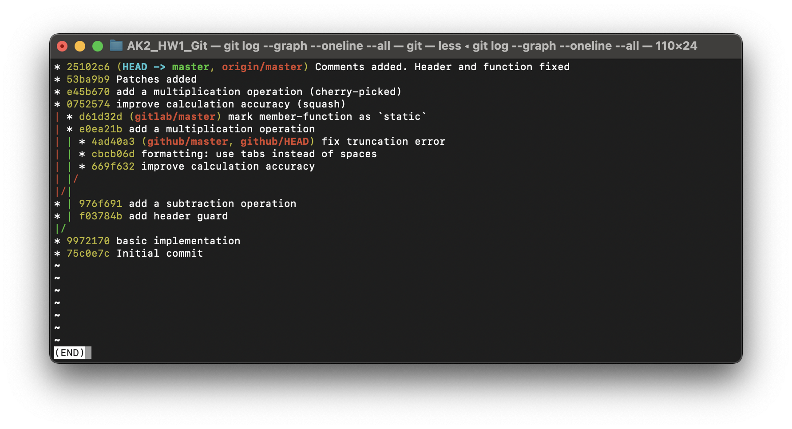

# AK2_HW1_GIT
## Граф:  

  

## Лістинг:

### calcalator.cpp

```cpp
#include "calculator.h"

// Addition function
int Calculator::Add (double a, double b)
{
	return a + b;
}

// Subtraction function
int Calculator::Sub (double a, double b)
{
    return Add (a, -b);
}

// Multiplication function
int Calculator::Mul (double a, double b)
{
    return a * b;
}
```
### calculator.h

```cpp
#ifndef CALCULATOR_H
#define CALCULATOR_H

class Calculator
{
    public:
        int Add (double, double);
        int Sub (double, double);
        int Mul (double, double);
};

#endif//CALCULATOR_H
```
## Патчі: 

### 0001-fix-truncation-error-change-position.patch

```
From 42b550e25f4ed80e3dae81bfdd0657b250acd8ca Mon Sep 17 00:00:00 2001
From: Sergii Piatakov <sergii.piatakov@globallogic.com>
Date: Thu, 15 Nov 2018 15:28:04 +0200
Subject: [PATCH] fix truncation error (change position)

To convert float to integer the truncation is performed, but the
rounding is expected.

Test: Add (4.9, 4.9) should return 10.
Signed-off-by: Sergii Piatakov <sergii.piatakov@globallogic.com>
---
 calculator.cpp | 2 +-
 1 file changed, 1 insertion(+), 1 deletion(-)

diff --git a/calculator.cpp b/calculator.cpp
index b91afea..d93e35b 100644
--- a/calculator.cpp
+++ b/calculator.cpp
@@ -2,7 +2,7 @@
 
 int Calculator::Add (double a, double b)
 {
-    return a + b;
+	return a + b + 0.5;
 }
 
 int Calculator::Sub (double a, double b)
-- 
2.24.3 (Apple Git-128)
```
### 0001-formatting-use-tabs-instead-of-spaces-changed-positi.patch

```
From 887dbcbc26c33dcfafc3b7796e9f0fffb04938e5 Mon Sep 17 00:00:00 2001
From: Sergii Piatakov <sergii.piatakov@globallogic.com>
Date: Thu, 15 Nov 2018 15:26:35 +0200
Subject: [PATCH] formatting: use tabs instead of spaces (changed position)

Signed-off-by: Sergii Piatakov <sergii.piatakov@globallogic.com>
---
 calculator.cpp | 4 ++--
 calculator.h   | 6 +++---
 2 files changed, 5 insertions(+), 5 deletions(-)

diff --git a/calculator.cpp b/calculator.cpp
index d93e35b..f323e14 100644
--- a/calculator.cpp
+++ b/calculator.cpp
@@ -2,10 +2,10 @@
 
 int Calculator::Add (double a, double b)
 {
-	return a + b + 0.5;
+	return a + b;
 }
 
 int Calculator::Sub (double a, double b)
 {
-    return Add (a, -b);
+	return Add (a, -b);
 }
diff --git a/calculator.h b/calculator.h
index 3740907..d59d596 100644
--- a/calculator.h
+++ b/calculator.h
@@ -3,9 +3,9 @@
 
 class Calculator
 {
-    public:
-        int Add (double, double);
-        int Sub (double, double);
+	public:
+		int Add (double, double);
+		int Sub (double, double);
 };
 
 #endif//CALCULATOR_H
-- 
2.24.3 (Apple Git-128)
```

## Висновок

В данній лабораторній роботі я ознайомився з приниципами системи контролю версій **Git**. 

